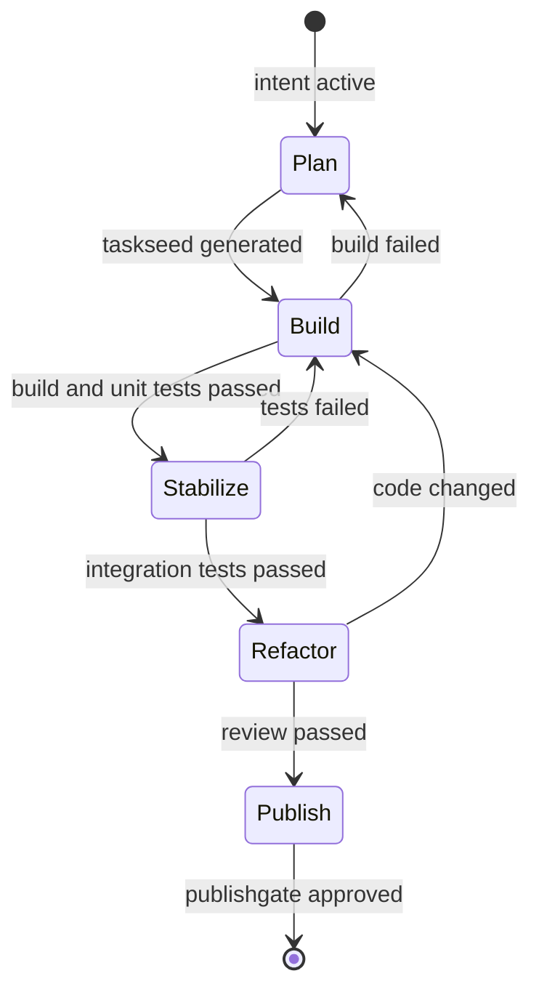

# 要件定義書の厳密仕様改訂報告書

## エグゼクティブサマリ
本書は、契約駆動型の AI ワークフローを実装可能なレベルまで厳密化した要件仕様です。従来の説明中心の記述を改め、文書構造、契約オブジェクト、状態遷移、承認フロー、権限、再現性、監査、並列実行を相互に矛盾しない形で定義します。

本仕様の対象は、`IntentContract -> TaskSeed -> Acceptance -> PublishGate -> Evidence` を中核とするオーケストレーションです。各契約は共通状態を持ち、イベント駆動で生成・更新されます。高リスク操作は `PublishGate` の承認ルールに従い、証跡は `Evidence` に統一フォーマットで保存されます。

この改訂では、以下を規範仕様として固定します。

- 契約共通状態は `Draft -> Active -> Frozen -> Published -> Superseded -> Revoked -> Archived` とする
- 全契約に `schemaVersion` `kind` `state` `createdAt` `updatedAt` `version` を必須化する
- 共通 schema は継承用ベースとし、具象 schema は `allOf` で合成して厳密化する
- `Evidence` の必須項目を 1 つの正本定義に統一する
- `PublishGate` に複数承認者、判定理由、期限、最終判断を表現できるデータモデルを持たせる
- ロールと capability を一致させ、各フェーズの実行主体と権限表の矛盾を解消する
- 自動生成トリガー、リトライ、タイムアウト、stale 判定、ロック制御、再現性項目を規範値として明文化する

## 1. 目的・非ゴール・MVP 範囲

### 1.1 目的
- 契約駆動型 AI ワークフローを実現する
- 各フェーズの入力・出力・判定条件を機械可読な契約として定義する
- 実行結果を再現可能な証跡として記録し、監査可能にする
- 高リスク操作に対して人間承認を強制できるようにする

### 1.2 非ゴール
- UI/UX 設計
- 特定ベンダー依存のデプロイ手順
- ハードウェア構成やネットワークトポロジの最適化
- モデル品質そのものの研究評価

### 1.3 MVP 範囲
MVP は以下の成功条件を満たすことです。

1. `IntentContract` の作成イベントから `TaskSeed` が自動生成される
2. `TaskSeed` の実行結果として `Acceptance` が生成される
3. `Acceptance` が `passed` の場合に `PublishGate` 判定へ進める
4. 実行ごとに `Evidence` が生成され、必要な再現情報が保存される
5. 高リスク操作では `PublishGate.finalDecision = approved` がない限り公開されない

## 2. 文書 3 層構成
仕様書は以下の 3 層で管理します。

- 要件定義層: 目的、非ゴール、MVP、ユースケース、非機能要件
- プロトコル仕様層: 契約オブジェクト、イベント、状態遷移、JSON Schema、API/CLI 入出力
- 運用ポリシー層: リスク承認、監査、ログ保持、例外対応、権限運用

役割ごとの参照範囲は以下とします。

- プロダクトオーナー: 要件定義層
- 実装者: 要件定義層 + プロトコル仕様層
- 運用者/監査者: 運用ポリシー層 + 必要に応じてプロトコル仕様層

## 3. システム前提とイベント駆動モデル

### 3.1 構成要素
- Contract Store: 契約オブジェクトの永続化層
- Event Bus: 契約生成・更新イベントの配送
- Orchestrator: 契約生成、状態遷移、再試行の制御
- TaskSeed Generator: `IntentContract` から `TaskSeed` を導出する生成器
- Validator: 実行結果から `Acceptance` を導出する検証器
- Policy Engine: capability とリスク判定、PublishGate 生成
- Executor: Build/Refactor/Validation を実行する主体
- Evidence Store: 監査証跡の保存先

### 3.2 規範イベント
イベント名は以下に固定します。

- `intent.created.v1`
- `taskseed.created.v1`
- `taskseed.execution.completed.v1`
- `acceptance.created.v1`
- `publishgate.created.v1`
- `publishgate.decision.recorded.v1`
- `evidence.created.v1`

### 3.3 自動生成トリガー
- `IntentContract.state = Active` になった時点で Orchestrator は `intent.created.v1` を発行する
- `intent.created.v1` を受けた TaskSeed Generator は 30 秒以内に `TaskSeed` を作成し、`IntentContract.requestedCapabilities` から `generationPolicy` を導出する
- TaskSeed の永続化完了後、Orchestrator は `taskseed.created.v1` を発行する
- `TaskSeed.state = Active` かつ実行完了時に Executor は `taskseed.execution.completed.v1` を発行する
- 実行結果を受けた Validator は 60 秒以内に `Acceptance` を作成し、`TaskSeed` の実行リスクと検証対象に応じて `generationPolicy` を導出する
- Acceptance の永続化完了後、Validator は `acceptance.created.v1` を発行する
- `Acceptance.status = passed` の場合、Policy Engine は `PublishGate` を作成する
- `PublishGate.riskLevel` が `low` または `medium` の場合、Policy Engine は `requiredApprovals = []` とし、通常は生成時に `finalDecision = approved` を設定する。ポリシー違反を検知した場合のみ `rejected` とする
- PublishGate の永続化完了後、Policy Engine は `publishgate.created.v1` を発行する
- Executor は各実行の終了後 30 秒以内に不変の監査記録として `Evidence` を `Published` 状態で作成し、永続化完了後に `evidence.created.v1` を発行する
- `PublishGate` に対する各承認、却下、または自動承認の記録時、Policy Engine は `publishgate.decision.recorded.v1` を発行する

`generationPolicy` の導出規則:

- `requestedCapabilities` が `read_repo` のみ、または `read_repo + write_repo` のみなら `auto_activate = true`
- `install_deps` または `network_access` を含む場合は `auto_activate = false` とし、`requiredActivationApprovals` に `project_lead` と `security_reviewer` を設定する
- `read_secrets` を含む場合は `auto_activate = false` とし、`requiredActivationApprovals` に `project_lead` と `security_reviewer` を設定する
- `publish_release` を含む場合は `auto_activate = false` とし、`requiredActivationApprovals` に `project_lead` と `release_manager` を設定する
- 複数条件に該当する場合、`requiredActivationApprovals` は和集合とする
- `TaskSeed` は `IntentContract.requestedCapabilities` を `requestedCapabilitiesSnapshot` として保持する
- `Acceptance` は既定で `TaskSeed.generationPolicy.requiredActivationApprovals` を継承し、`TaskSeed.requestedCapabilitiesSnapshot` が `read_repo` のみ、または `read_repo + write_repo` のみの場合に限り `auto_activate = true` としてよい

### 3.4 再試行と冪等性
- 各自動生成処理は最大 3 回まで再試行する
- 再試行間隔は 30 秒、60 秒、120 秒の指数バックオフとする
- 契約生成の冪等キーは `sourceContractId + sourceVersion + targetKind` とする
- 3 回失敗した場合、生成対象が永続化済みならその対象契約を `Frozen` に遷移し、未永続化なら生成元契約を `Frozen` に遷移して障害イベントを記録する

## 4. 契約共通ルール

### 4.1 共通必須フィールド
全契約は以下を必須とします。以下の schema は継承用ベースであり、単体で最終バリデーションに使ってはなりません。具象 schema は `allOf: [{"$ref":"common.schema.json"}, {...具象定義...}]` で合成し、最終 schema 側で `unevaluatedProperties: false` を指定します。`allOf` で合成される具象側サブ schema では、共通 schema 由来プロパティを不当に拒否しないよう `additionalProperties` を指定してはなりません。

```json
{
  "$schema": "https://json-schema.org/draft/2020-12/schema",
  "type": "object",
  "required": [
    "schemaVersion",
    "id",
    "kind",
    "state",
    "version",
    "createdAt",
    "updatedAt"
  ],
  "properties": {
    "schemaVersion": {
      "type": "string",
      "const": "1.0.0"
    },
    "id": {
      "type": "string",
      "pattern": "^[A-Z]{2,4}-[0-9]{3,}$"
    },
    "kind": {
      "type": "string",
      "enum": [
        "IntentContract",
        "TaskSeed",
        "Acceptance",
        "PublishGate",
        "Evidence"
      ]
    },
    "state": {
      "type": "string",
      "enum": [
        "Draft",
        "Active",
        "Frozen",
        "Published",
        "Superseded",
        "Revoked",
        "Archived"
      ]
    },
    "version": {
      "type": "integer",
      "minimum": 1
    },
    "createdAt": {
      "type": "string",
      "format": "date-time"
    },
    "updatedAt": {
      "type": "string",
      "format": "date-time"
    }
  }
}
```

### 4.2 状態遷移ルール
共通状態の意味は以下のとおりです。

- `Draft`: 作成直後。編集可能、実行不可
- `Active`: 実行対象。関連イベントを発行可能
- `Frozen`: 一時停止。要調査。自動実行不可
- `Published`: 公開判断または採用判断が完了した最終有効状態
- `Superseded`: 後継バージョンに置換済み
- `Revoked`: 明示的に無効化
- `Archived`: 保管専用。変更不可

状態遷移の制約は以下です。

- `Draft -> Active` は明示承認時のみ許可
- システム自動生成された `TaskSeed` および `Acceptance` は、生成元契約が `Active` かつ生成ポリシーで `auto_activate = true` の場合に限り、初期状態を `Active` として作成してよい
- システム自動生成された `PublishGate` は、`finalDecision = pending` の場合のみ初期状態を `Active` とし、`riskLevel` が `low` または `medium` で `requiredApprovals = []` かつ `finalDecision = approved` の場合に限り初期状態を `Published` として作成してよい
- システム自動生成された `Evidence` は不変記録のため初期状態を `Published` として作成し、`Draft` または `Active` を経由してはならない
- システム自動生成された `TaskSeed` または `Acceptance` が `Draft` の場合、`generationPolicy.requiredActivationApprovals` に定義された全ロールの承認完了後にのみ `Active` へ遷移できる
- `IntentContract` `TaskSeed` `Acceptance` の `Active -> Published` は `PublishGate.finalDecision = approved` を満たす場合のみ許可
- `PublishGate` の `Active -> Published` は `requiredApprovals` を全充足したうえで `finalDecision = approved` になった場合のみ許可
- `Active -> Frozen` は障害、要手動確認、外部依存異常時に許可
- `Published -> Superseded` は後継契約の `version` がより大きい場合のみ許可
- `Draft|Active|Frozen|Published -> Revoked` は監査または手動停止で許可
- `Superseded|Revoked|Published -> Archived` は保持期限または運用ルール到達時に許可

## 5. 契約型仕様

### 5.1 IntentContract
具象 schema は以下のように `common.schema.json` と合成する。

```json
{
  "$defs": {
    "capability": {
      "type": "string",
      "enum": [
        "read_repo",
        "write_repo",
        "install_deps",
        "network_access",
        "read_secrets",
        "publish_release"
      ]
    }
  },
  "allOf": [
    { "$ref": "common.schema.json" },
    {
  "title": "IntentContract",
  "type": "object",
  "required": [
    "intent",
    "creator",
    "priority",
    "requestedCapabilities"
  ],
  "properties": {
    "kind": { "const": "IntentContract" },
    "id": { "type": "string", "pattern": "^IC-[0-9]{3,}$" },
    "intent": { "type": "string", "minLength": 1 },
    "creator": { "type": "string", "minLength": 1 },
    "priority": { "type": "string", "enum": ["low", "medium", "high", "critical"] },
    "requestedCapabilities": {
      "type": "array",
      "items": { "$ref": "#/$defs/capability" },
      "minItems": 1,
      "uniqueItems": true
    }
  }
    }
  ],
  "unevaluatedProperties": false
}
```

### 5.2 TaskSeed
```json
{
  "allOf": [
    { "$ref": "common.schema.json" },
    {
  "title": "TaskSeed",
  "type": "object",
  "required": [
    "intentId",
    "description",
    "ownerRole",
    "executionPlan",
    "requestedCapabilitiesSnapshot",
    "generationPolicy"
  ],
  "properties": {
    "kind": { "const": "TaskSeed" },
    "id": { "type": "string", "pattern": "^TS-[0-9]{3,}$" },
    "intentId": { "type": "string", "pattern": "^IC-[0-9]{3,}$" },
    "description": { "type": "string", "minLength": 1 },
    "ownerRole": {
      "type": "string",
      "enum": ["developer", "ci_agent", "qa", "project_lead", "release_manager", "admin"]
    },
    "executionPlan": {
      "type": "array",
      "items": { "type": "string", "minLength": 1 },
      "minItems": 1
    },
    "requestedCapabilitiesSnapshot": {
      "type": "array",
      "items": {
        "type": "string",
        "enum": [
          "read_repo",
          "write_repo",
          "install_deps",
          "network_access",
          "read_secrets",
          "publish_release"
        ]
      },
      "minItems": 1,
      "uniqueItems": true
    },
    "generationPolicy": {
      "type": "object",
      "required": ["auto_activate", "requiredActivationApprovals"],
      "properties": {
        "auto_activate": { "type": "boolean" },
        "requiredActivationApprovals": {
          "type": "array",
          "items": {
            "type": "string",
            "enum": ["policy_engine", "project_lead", "security_reviewer", "release_manager", "admin"]
          },
          "uniqueItems": true
        }
      },
      "allOf": [
        {
          "if": {
            "properties": {
              "auto_activate": { "const": false }
            }
          },
          "then": {
            "properties": {
              "requiredActivationApprovals": {
                "minItems": 1
              }
            }
          }
        }
      ],
      "additionalProperties": false
    }
  }
    }
  ],
  "unevaluatedProperties": false
}
```

### 5.3 Acceptance
```json
{
  "allOf": [
    { "$ref": "common.schema.json" },
    {
  "title": "Acceptance",
  "type": "object",
  "required": [
    "taskSeedId",
    "status",
    "details",
    "criteria",
    "generationPolicy"
  ],
  "properties": {
    "kind": { "const": "Acceptance" },
    "id": { "type": "string", "pattern": "^AC-[0-9]{3,}$" },
    "taskSeedId": { "type": "string", "pattern": "^TS-[0-9]{3,}$" },
    "status": {
      "type": "string",
      "enum": ["pending", "passed", "failed", "blocked"]
    },
    "details": { "type": "string", "minLength": 1 },
    "criteria": {
      "type": "array",
      "items": { "type": "string", "minLength": 1 },
      "minItems": 1
    },
    "generationPolicy": {
      "type": "object",
      "required": ["auto_activate", "requiredActivationApprovals"],
      "properties": {
        "auto_activate": { "type": "boolean" },
        "requiredActivationApprovals": {
          "type": "array",
          "items": {
            "type": "string",
            "enum": ["project_lead", "security_reviewer", "release_manager", "admin"]
          },
          "uniqueItems": true
        }
      },
      "allOf": [
        {
          "if": {
            "properties": {
              "auto_activate": { "const": false }
            }
          },
          "then": {
            "properties": {
              "requiredActivationApprovals": {
                "minItems": 1
              }
            }
          }
        }
      ],
      "additionalProperties": false
    }
  }
    }
  ],
  "unevaluatedProperties": false
}
```

### 5.4 PublishGate
```json
{
  "allOf": [
    { "$ref": "common.schema.json" },
    {
  "title": "PublishGate",
  "type": "object",
  "required": [
    "entityId",
    "action",
    "riskLevel",
    "requiredApprovals",
    "approvals",
    "finalDecision"
  ],
  "properties": {
    "kind": { "const": "PublishGate" },
    "id": { "type": "string", "pattern": "^PG-[0-9]{3,}$" },
    "entityId": { "type": "string", "pattern": "^AC-[0-9]{3,}$" },
    "action": { "type": "string", "enum": ["publish", "reject", "hold"] },
    "riskLevel": { "type": "string", "enum": ["low", "medium", "high", "critical"] },
    "requiredApprovals": {
      "type": "array",
      "items": {
        "type": "string",
        "enum": ["project_lead", "security_reviewer", "release_manager", "admin"]
      },
      "minItems": 0,
      "uniqueItems": true
    },
    "approvals": {
      "type": "array",
      "items": {
        "type": "object",
        "required": ["role", "actorId", "decision", "decidedAt"],
        "properties": {
          "role": {
            "type": "string",
            "enum": ["policy_engine", "project_lead", "security_reviewer", "release_manager", "admin"]
          },
          "actorId": { "type": "string", "minLength": 1 },
          "decision": { "type": "string", "enum": ["approved", "rejected"] },
          "decidedAt": { "type": "string", "format": "date-time" },
          "reason": { "type": "string" }
        },
        "additionalProperties": false
      }
    },
    "finalDecision": {
      "type": "string",
      "enum": ["pending", "approved", "rejected", "expired"]
    },
    "approvalDeadline": {
      "type": "string",
      "format": "date-time"
    }
  },
  "allOf": [
    {
      "if": {
        "properties": {
          "requiredApprovals": {
            "minItems": 1
          }
        }
      },
      "then": {
        "required": ["approvalDeadline"]
      }
    },
    {
      "if": {
        "properties": {
          "requiredApprovals": {
            "maxItems": 0
          }
        }
      },
      "then": {
        "properties": {
          "finalDecision": {
            "enum": ["approved", "rejected"]
          }
        }
      }
    }
  ]
    }
  ],
  "unevaluatedProperties": false
}
```

### 5.5 Evidence
`Evidence` の最小必須セットは本節を正本とし、他節は本節に従います。

```json
{
  "allOf": [
    { "$ref": "common.schema.json" },
    {
  "title": "Evidence",
  "type": "object",
  "required": [
    "taskSeedId",
    "baseCommit",
    "headCommit",
    "inputHash",
    "outputHash",
    "model",
    "tools",
    "environment",
    "staleStatus",
    "mergeResult",
    "startTime",
    "endTime",
    "actor",
    "policyVerdict",
    "diffHash"
  ],
  "properties": {
    "kind": { "const": "Evidence" },
    "id": { "type": "string", "pattern": "^EV-[0-9]{3,}$" },
    "taskSeedId": { "type": "string", "pattern": "^TS-[0-9]{3,}$" },
    "baseCommit": { "type": "string", "minLength": 7 },
    "headCommit": { "type": "string", "minLength": 7 },
    "inputHash": { "type": "string", "minLength": 1 },
    "outputHash": { "type": "string", "minLength": 1 },
    "model": {
      "type": "object",
      "required": ["name", "version", "parametersHash"],
      "properties": {
        "name": { "type": "string", "minLength": 1 },
        "version": { "type": "string", "minLength": 1 },
        "parametersHash": { "type": "string", "minLength": 1 }
      },
      "additionalProperties": false
    },
    "tools": {
      "type": "array",
      "items": { "type": "string", "minLength": 1 },
      "minItems": 1
    },
    "environment": {
      "type": "object",
      "required": ["os", "runtime", "containerImageDigest", "lockfileHash"],
      "properties": {
        "os": { "type": "string", "minLength": 1 },
        "runtime": { "type": "string", "minLength": 1 },
        "containerImageDigest": { "type": "string", "minLength": 1 },
        "lockfileHash": { "type": "string", "minLength": 1 }
      },
      "additionalProperties": false
    },
    "staleStatus": {
      "type": "object",
      "required": ["classification", "evaluatedAt"],
      "properties": {
        "classification": {
          "type": "string",
          "enum": ["fresh", "soft_stale", "hard_stale"]
        },
        "evaluatedAt": { "type": "string", "format": "date-time" },
        "reason": { "type": "string" }
      },
      "additionalProperties": false
    },
    "mergeResult": {
      "type": "object",
      "required": ["status"],
      "properties": {
        "status": {
          "type": "string",
          "enum": ["not_applicable", "not_attempted", "merged", "manual_resolution_required"]
        },
        "mergedAt": { "type": "string", "format": "date-time" },
        "strategy": { "type": "string" },
        "reason": { "type": "string" }
      },
      "additionalProperties": false
    },
    "startTime": { "type": "string", "format": "date-time" },
    "endTime": { "type": "string", "format": "date-time" },
    "actor": { "type": "string", "minLength": 1 },
    "approvalsSnapshot": {
      "type": "array",
      "items": {
        "type": "object",
        "required": ["role", "actorId", "decision", "decidedAt"],
        "properties": {
          "role": {
            "type": "string",
            "enum": ["project_lead", "security_reviewer", "release_manager", "admin"]
          },
          "actorId": { "type": "string", "minLength": 1 },
          "decision": { "type": "string", "enum": ["approved", "rejected"] },
          "decidedAt": { "type": "string", "format": "date-time" },
          "reason": { "type": "string" }
        },
        "additionalProperties": false
      },
      "minItems": 1
    },
    "policyVerdict": {
      "type": "string",
      "enum": ["approved", "rejected", "manual_review_required"]
    },
    "diffHash": { "type": "string", "minLength": 1 }
  }
    }
  ],
  "unevaluatedProperties": false
}
```

## 6. 実行フェーズの状態遷移
フェーズ遷移は以下に固定します。



| 遷移元 | 遷移先 | トリガー | 実行主体 | 必須証拠 | ガード条件 | リトライ | タイムアウト | 手動介入 |
|---|---|---|---|---|---|---|---|---|
| Plan | Build | `taskseed.created.v1` | orchestrator | TaskSeed | IntentContract が `Active` | 不可 | 30 秒 | 不要 |
| Build | Stabilize | ビルド成功 | developer / ci_agent | build log, unit test result, Evidence | unit test 成功 | 3 回 | 20 分 | 任意 |
| Build | Plan | ビルド失敗 | ci_agent | error log, Evidence | retry 上限超過 | 3 回 | 20 分 | 必須 |
| Stabilize | Refactor | 統合テスト成功 | qa / ci_agent | integration report, Evidence | acceptance criteria 充足 | 2 回 | 30 分 | 任意 |
| Stabilize | Build | テスト失敗 | qa / ci_agent | failed test log, Evidence | acceptance 不充足 | 2 回 | 30 分 | 任意 |
| Refactor | Publish | レビュー成功 | developer / project_lead | review result, Evidence | blocking issue なし | 1 回 | 10 分 | 任意 |
| Publish | Published | `PublishGate.finalDecision = approved` | policy_engine / release_manager / admin | PublishGate, release note, Evidence | low/medium は `policy_engine` による自動承認可、high/critical は requiredApprovals を全充足 | 不可 | low/medium は即時、high/critical は approvalDeadline まで | high/critical のみ必須 |

実行主体の選択規則:

- Build/Refactor は `requestedCapabilities` に `install_deps` または `network_access` を含む場合 `ci_agent` を優先し、それ以外は `developer` を既定主体とする
- Stabilize は自動テストのみなら `ci_agent`、手動検証を含む場合は `qa` を主体とする
- Refactor -> Publish のレビュー承認は、差分が low/medium リスクなら `project_lead`、high/critical リスクなら `project_lead` に加えて `security_reviewer` のレビュー完了を必須とする
- Publish は low/medium の自動承認時は `policy_engine`、`publish_release` capability を含む場合は `release_manager`、緊急停止または管理者代行時のみ `admin` を主体とする
- 監査ログの `role` には、上記規則で実際に選ばれた単一主体のみを保存する

## 7. リスク分類と PublishGate 判定

### 7.1 リスク分類
- `low`: read-only 操作のみ。公開・外部通信・依存追加なし
- `medium`: repo 書き込みあり。外部通信なし。本番影響なし
- `high`: `install_deps` `network_access` `read_secrets` `publish_release` のいずれかを含む
- `critical`: 本番データ変更、シークレット外部送信、法令・契約違反の可能性、またはロールバック不能な公開

### 7.2 規範判定ルール
- requestedCapabilities に `read_secrets` が含まれる場合、最低 `high`
- requestedCapabilities に `publish_release` が含まれる場合、最低 `high`
- 本番環境または customer data への書き込みを伴う場合、`critical`
- `high` 以上では人間承認必須
- `critical` では `security_reviewer` と `release_manager` の両承認を必須とする

### 7.3 PublishGate 承認ルール
- `low`: `requiredApprovals = []` とし、Policy Engine は通常 `finalDecision = approved` を設定する。ポリシー違反を検知した場合のみ `rejected` とする
- `medium`: `requiredApprovals = []` とし、Policy Engine は通常 `finalDecision = approved` を設定する。ポリシー違反を検知した場合のみ `rejected` とする
- `high`: `requiredApprovals = ["project_lead", "security_reviewer"]`
- `critical`: `requiredApprovals = ["project_lead", "security_reviewer", "release_manager"]`
- `requiredApprovals` が空でない場合、`approvalDeadline` は必須とする
- `requiredApprovals = []` の場合、`finalDecision = pending` は禁止し、生成時に `approved` または `rejected` のどちらかへ確定させる
- `approvalDeadline` 経過時に未完了なら `finalDecision = expired`
- Refactor -> Publish で行うレビュー承認は品質レビューであり、PublishGate の人間承認要件とは別に扱う

## 8. capability とアクセス制御マトリクス
capability は以下の 6 種に固定します。

- `read_repo`
- `write_repo`
- `install_deps`
- `network_access`
- `read_secrets`
- `publish_release`

ロール定義は以下です。

- `requester`
- `orchestrator`
- `policy_engine`
- `developer`
- `ci_agent`
- `qa`
- `project_lead`
- `release_manager`
- `security_reviewer`
- `admin`

| ロール | read_repo | write_repo | install_deps | network_access | read_secrets | publish_release |
|---|---|---|---|---|---|---|
| requester | ○ | - | - | - | - | - |
| orchestrator | - | - | - | - | - | - |
| policy_engine | - | - | - | - | - | - |
| developer | ○ | ○ | - | - | - | - |
| ci_agent | ○ | ○ | ○ | ○ | - | - |
| qa | ○ | ○ | - | - | - | - |
| project_lead | ○ | ○ | - | - | - | - |
| release_manager | ○ | ○ | - | - | - | ○ |
| security_reviewer | ○ | - | - | - | ○ | - |
| admin | ○ | ○ | ○ | ○ | ○ | ○ |

運用ルールは以下です。

- フェーズ表に登場する主体は必ず本表のロールと一致させる
- capability 未付与の操作は Orchestrator が拒否する
- `developer` が Build/Refactor を行うため `write_repo` は必須とする
- `project_lead` と `security_reviewer` の承認行為は capability ではなく PublishGate 上のロール責務として扱う
- `orchestrator` は repo capability を持たず、契約生成・状態遷移・イベント発行のみを行うシステムロールとする
- `policy_engine` は repo capability を持たず、risk 判定・PublishGate 生成・自動承認のみを行うシステムロールとする

## 9. Evidence と再現性要件
再現性のため、以下を必須保存対象とします。

- 基準コミット `baseCommit`
- 実行後コミット `headCommit`
- 入力正規化後ハッシュ `inputHash`
- 出力ハッシュ `outputHash`
- モデル名、モデル版、推論パラメータハッシュ
- 使用ツール一覧
- OS、ランタイム、コンテナイメージ digest、依存 lockfile hash
- stale 判定結果
- 自動マージ結果
- 開始・終了時刻
- 実行者 ID
- ポリシー判定
- 差分ハッシュ

追加ルール:

- 手動承認が発生した場合のみ `approvalsSnapshot` を必須とし、PublishGate.approvals と同一内容を保存する
- `startTime <= endTime` を満たさない Evidence は無効とする
- `baseCommit` と `headCommit` が同一でも許可するが、その場合は `diffHash` に空差分ハッシュを保存する
- `containerImageDigest` が存在しない実行環境では固定値 `uncontainerized` を保存する

検証境界:

- JSON Schema で担保する範囲: 必須項目、型、列挙値、ネスト構造、追加プロパティ禁止
- アプリケーション検証で担保する範囲: `approvalsSnapshot` の条件必須、`startTime <= endTime`、`inputHash` と正規化手順の整合、`uncontainerized` の代替値適用、`TaskSeed.requestedCapabilitiesSnapshot` と生成元 `IntentContract.requestedCapabilities` の一致
- CI では schema test と別に semantic validation test を設け、上記アプリケーション検証を必須とする

## 10. stale 判定とコンテキスト更新
stale 判定は例示ではなく以下を規範値とします。

- `soft_stale`: 最終取得から 10 分超
- `hard_stale`: 最終取得から 60 分超、または依存契約/version が変化、または参照コミットが変化

運用ルール:

- `soft_stale` の場合、再取得を試みつつ処理継続を許可する
- `hard_stale` の場合、再取得成功まで処理を停止し `Frozen` に遷移可能とする
- stale 判定結果は Evidence に付随ログとして保存する

## 11. スウォーム並列実行と競合制御
共有リソース競合を避けるため、以下を規範化します。

- ロック単位は `contract:<id>` または `repo-path:<normalized-path>` とする
- ロック TTL は 300 秒
- ロック延長は 60 秒ごとに heartbeat を送る
- heartbeat が 2 回連続失敗した場合、ロックは失効可能とする
- ロック取得失敗時は 15 秒、30 秒、60 秒で最大 3 回リトライする
- 3 回失敗後は `Frozen` に遷移し、手動解消待ちとする

マージ戦略:

- 同一契約の競合更新は `version` が高い方を優先する
- 同一 version の競合は `updatedAt` の新しい方を優先せず、必ず手動解消とする
- 自動マージ結果は必ず Evidence に記録する

## 12. 監査・ログ保持要件
全操作ログは最低 1 年保存し、以下を検索キーにします。

- `contractId`
- `taskSeedId`
- `actorId`
- `role`
- `action`
- `riskLevel`
- `finalDecision`
- `date`

必須ログ項目:

- timestamp
- contract kind/id/version
- actorId
- role
- action
- success/failure
- error message
- approval decision
- environment summary

## 13. テスト・検証基準
Acceptance の完了条件は以下を最低限満たすことです。

1. IntentContract から TaskSeed が 1 回だけ自動生成される
2. TaskSeed 実行後に Evidence が必ず生成される
3. Acceptance.status が `passed` のときのみ PublishGate が生成される
4. `low` と `medium` では requiredApprovals が空となり自動承認、`high` 以上では requiredApprovals が正しく設定される
5. `high` 以上では `approvalDeadline` が設定され、PublishGate の requiredApprovals を満たさない限り `Published` へ遷移しない
6. 各契約 kind の `id` が規定 prefix に一致する
7. stale と lock 例外時に `Frozen` 遷移が発生する

自動テスト区分:

- Schema test: 各契約 JSON が厳密 schema に適合すること
- Orchestration test: イベントから契約生成までの遷移が正しいこと
- Policy test: capability と riskLevel の判定が正しいこと
- Reproducibility test: Evidence 必須項目が欠けると失敗すること
- Concurrency test: ロック競合時に期待どおり再試行/凍結すること

## 14. 変更管理とバージョニング
- 契約 Schema と実装コードは同一リポジトリで管理する
- 破壊的変更は major、後方互換ありの追加は minor、文言修正や非互換なし変更は patch とする
- `schemaVersion` は schema の互換性境界で更新する
- 互換性を壊す変更では migration 手順とサンプル変換を必須とする
- CI は schema 変更時に schema test と orchestration test を必須実行する

## 15. 再構成版ファイル構成案

| ファイルパス | 内容概要 |
|---|---|
| `docs/requirements.md` | 目的、非ゴール、MVP、非機能要件 |
| `docs/protocol.md` | 契約仕様、イベント、状態遷移、schema 解説 |
| `docs/operations.md` | 承認、監査、保持期間、障害運用 |
| `schemas/common.schema.json` | 共通契約 schema |
| `schemas/IntentContract.schema.json` | IntentContract schema |
| `schemas/TaskSeed.schema.json` | TaskSeed schema |
| `schemas/Acceptance.schema.json` | Acceptance schema |
| `schemas/PublishGate.schema.json` | PublishGate schema |
| `schemas/Evidence.schema.json` | Evidence schema |
| `diagrams/state_transitions.mmd` | Mermaid 状態図 |
| `tables/access_matrix.md` | ロールと capability の対応表 |
| `tables/risk_classification.md` | リスク分類と承認ルール |
| `tests/schema/` | schema 検証テスト |
| `tests/orchestration/` | イベント遷移テスト |
| `tests/policy/` | リスク/権限判定テスト |
| `tests/concurrency/` | ロックと stale テスト |
| `CHANGELOG.md` | 変更履歴 |

## 16. 今回の改訂で解消した不整合
- 共通状態に `Published` を追加し、状態定義と本文の表現を一致させた
- 全契約に `state` を明示的に持たせた
- 共通 schema を継承用ベースとし、具象 schema を `allOf` 合成で成立させた
- `Evidence` の必須項目を 1 つの正本定義へ統一した
- `PublishGate` に複数承認者、最終判断、期限を追加した
- フェーズ主体とアクセス制御ロールを一致させた
- stale、lock、retry を「例」ではなく規範値に変更した
- 再現性要件として環境・モデル・入力正規化情報を必須化した
